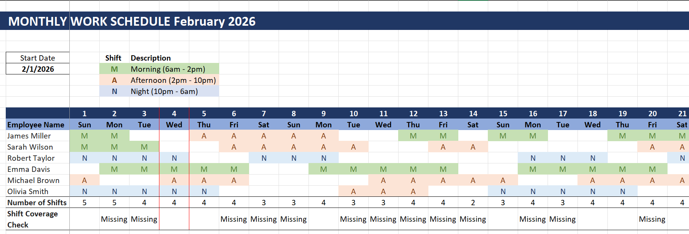
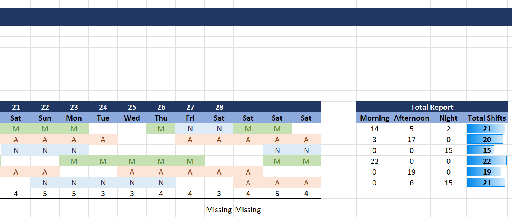

# Employee-Schedule-Tracker-using-Excel
Employee Schedule Tracker using Excel


## 📑 Table of Contents

* [🎯 Project Goal](#-project-goal)
* [✨ Features](#-features)
* [1️⃣ Setup & Structure](#1️⃣-setup--structure)
* [2️⃣ Shifts & Employees](#2️⃣-shifts--employees)
* [3️⃣ Dynamic Dates & Weekdays](#3️⃣-dynamic-dates--weekdays)
* [4️⃣ Header Formatting](#4️⃣-header-formatting)
* [5️⃣ Shift Dropdowns](#5️⃣-shift-dropdowns)
* [6️⃣ Conditional Formatting](#6️⃣-conditional-formatting)
* [7️⃣ Daily Staffing Count](#7️⃣-daily-staffing-count)
* [8️⃣ Coverage Validation](#8️⃣-coverage-validation)
* [9️⃣ Freeze Panes](#9️⃣-freeze-panes)
* [🔟 Employee Shift Totals](#🔟-employee-shift-totals)
* [1️⃣1️⃣ Workload Visualization](#1️⃣1️⃣-workload-visualization)
* [1️⃣2️⃣ Highlight Today](#1️⃣2️⃣-highlight-today)
* [1️⃣3️⃣ Duplicate for New Months](#1️⃣3️⃣-duplicate-for-new-months)
* [📸 Screenshots](#-screenshots)

---

## 🎯 Project Goal

This project demonstrates how to build a **fully dynamic monthly work schedule tracker in Excel** that updates automatically based on a selected start date.

---

## ✨ Features

* Shift tracking: **Morning / Afternoon / Night**
* Dropdown-based shift selection
* Auto-generated dates & weekdays
* Daily staffing count
* Missing shift detection
* Per-employee shift totals
* Today’s date highlighting
* Easy duplication for future months

---

## 1️⃣ Setup & Structure

### 📅 Start Date

Enter a start date (e.g. `01/01/2026`) into a single cell.

This date controls:

* Schedule title
* Number of days in the month
* Weekday labels

---

### 🏷️ Dynamic Title (Month + Year)

**Formula**

```excel
="MONTHLY WORK SCHEDULE " & TEXT(B6,"mmmm yyyy")
```

**Behavior**

* Updates automatically when the start date changes
* Example:

  * January 2026 → *MONTHLY WORK SCHEDULE January 2026*
  * February 2026 → *MONTHLY WORK SCHEDULE February 2026*

---

## 2️⃣ Shifts & Employees

### 🔁 Shift Definitions

| Code | Shift     | Time Range    |
| ---- | --------- | ------------- |
| M    | Morning   | 06:00 – 14:00 |
| A    | Afternoon | 14:00 – 22:00 |
| N    | Night     | 22:00 – 06:00 |

---

### 👥 Employee List

Employees are listed vertically and can be extended freely:

* James Miller
* Sarah Wilson
* Robert Taylor
* Emma Davis
* Michael Brown
* Olivia Smith

---

## 3️⃣ Dynamic Dates & Weekdays

### 🧮 Generate Dates Automatically

**Formula**

```excel
=SEQUENCE(1, EOMONTH(B6,0) - B6 + 1, B6)
```

**Explanation**

* Automatically adapts to 28 / 30 / 31 days
* Updates when the month changes

---

### 📆 Weekday Labels

**Formula**

```excel
=TEXT(C10,"ddd")
```

Displays abbreviated weekday names (Mon, Tue, Wed, …).

---

## 4️⃣ Header Formatting

Recommended styling:

* Dark blue background → dates
* Light blue background → weekdays
* White text
* Bold headers
* Borders around the start date

Purpose: **clarity and professional layout**

---

## 5️⃣ Shift Dropdowns

### ⬇️ Data Validation

**Steps**

1. Select the scheduling area
2. Go to **Data → Data Validation**
3. Choose **List**
4. Source:

   ```
   M,A,N
   ```

Prevents invalid text entries and keeps data consistent.

---

## 6️⃣ Conditional Formatting

### 🎨 Shift Colors

| Shift | Color Example |
| ----- | ------------- |
| M     | Green         |
| A     | Orange        |
| N     | Dark / Blue   |

**Rule Example**

```
Cell Value = "M"
```

Duplicate and adjust for `"A"` and `"N"`.

---

## 7️⃣ Daily Staffing Count

### 📊 Employees Scheduled Per Day

**Formula**

```excel
=COUNTA(C11:C20)
```

Helps identify under- or over-staffing for each day.

---

## 8️⃣ Coverage Validation

### 🧠 Detect Missing Shifts

Each day must include **at least one M, A, and N**.

**Formula**

```excel
=IF(MIN(COUNTIF(C11:C20,{"M","A","N"}))=0,"Missing","")
```

* Displays **"Missing"** if any shift is unassigned
* Blank if coverage is complete

---

## 9️⃣ Freeze Panes

Freeze the employee name column to keep names visible while scrolling.

**Path**

```
View → Freeze Panes
```

---

## 🔟 Employee Shift Totals

### 📈 Per-Employee Breakdown

**Shift Count Formula (example: Morning)**

```excel
=COUNTIF($C11:$AG11,"M")
```

Repeat for `"A"` and `"N"`.

---

### ➕ Total Shifts

```excel
=SUM(D11:F11)
```

---

## 1️⃣1️⃣ Workload Visualization

### 📊 Data Bars

* Applied to **Total Shifts**
* Quickly highlights workload imbalance between employees

---

## 1️⃣2️⃣ Highlight Today

### 🎯 Conditional Formatting

**Formula**

```excel
=C$10=TODAY()
```

Highlights the entire column for today using borders or fill color.

---

## 1️⃣3️⃣ Duplicate for New Months

### 📑 Create the Next Month

1. Duplicate the worksheet (`Ctrl + Drag`)
2. Update the start date

Automatically updates:

* Title
* Dates
* Weekdays
* Coverage logic
* Totals

### 🔄 Reset Shifts

* Select shift cells
* Press **Delete**
* All formulas remain intact

---

## 📸 Screenshots

> Example outputs of the completed tracker.

### Monthly Schedule View



### Shift Summary



